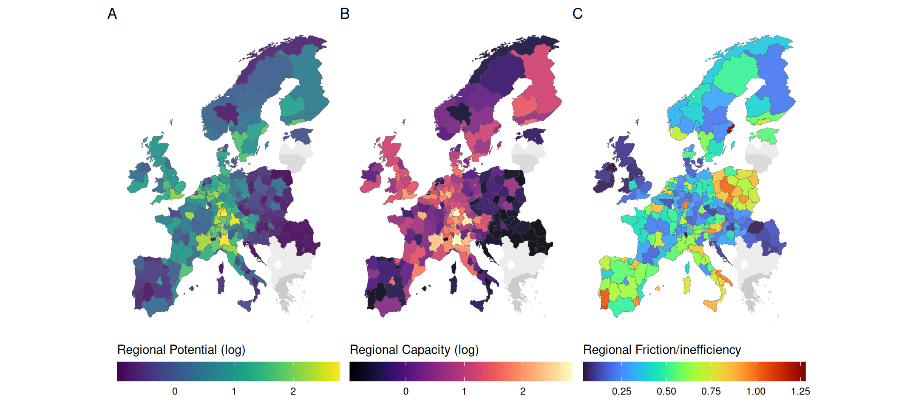
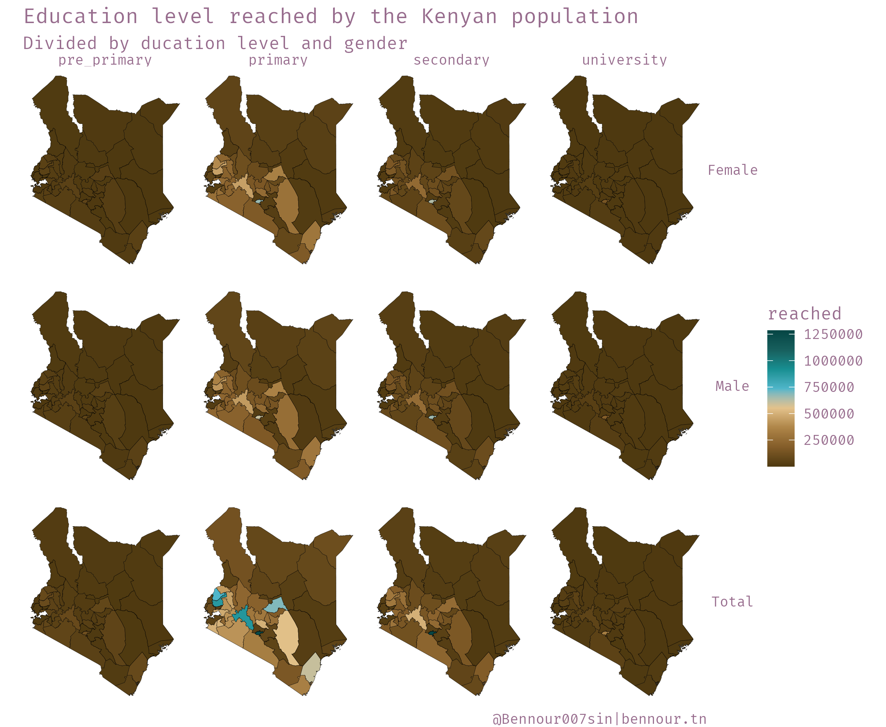

## Personal Background

A Data Analyst with a background in Economics and Econometrics brings comprehensive technical expertise across multiple tools and platforms. Proficiency in R spans the Shiny, Tidyverse, Tidymodels, and targets ecosystems, alongside strong capabilities in Git version control and Linux environments. Intermediate-level skills include Python's data science stack (pandas, numpy, sklearn), Power BI's full suite (Models, DAX, M, SSRS), and SQL database management (PostgreSQL, MS-Server, Azure). Additional familiarity with GIS software specifically QGIS and ArcGIS, and other tools such as Julia, LaTeX, Matlab, Tableau, and Alteryx enables flexibility across diverse analytical contexts.

Academic training includes a BA in Econometrics from ISG Sousse, emphasizing probability and statistics, followed by an MSc in Business Analytics from Tunis Business School with focus areas in efficiency analysis, modeling, and computational statistics. Currently pursuing a Ph.D. in Regional Development at the University of Pécs, research interests center on network science, spatial econometrics, data visualization and the continuous pursuit of learning opportunities that bridge technical skills with real-world impact.

## Experience

**IDMC** Work at IDMC centered on automating ETL pipelines for MSNA data analysis, leveraging R's targets framework for reproducible workflows and srvyr for survey data processing. The role required translating complex data collection requirements into automated systems that ensured consistency and scalability across multiple analytical cycles.

**Geomatys** Responsibilities at Geomatys involved refactoring and optimizing existing R code bases to improve efficiency and scalability. The consultancy focused on restructuring analytical workflows, implementing best practices for code organization, and enhancing performance for large-scale data operations while maintaining backward compatibility with existing systems.

**REACH Initiative** The Data Officer position at REACH Initiative encompassed coordinating cross-team data collection inputs while designing end-to-end pipelines and dashboards. Work involved integrating R, Python, PostgreSQL, and Azure to create cohesive data infrastructure. Regular use of data orchestration tools organized complex processes efficiently, as multiple teams relied on timely and accurate outputs for their operations and decision-making.

## Examples of Visualisation work

### Freedom Index

### EU Regional Technological Inefficiency

### Bee Colonies in the US

### Kenya Census data-set

### Nuclear explosions

